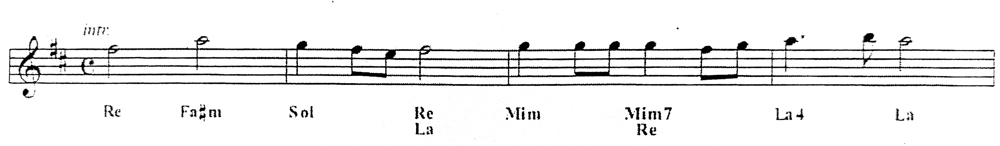

<h1 style="margin-bottom:0;">Gloria</h1>
Tommaso Bailo, Renato Giorgi
  

#### Ritornello:

**Re La Sol Re &ensp;Mi- &emsp; Do &emsp; &emsp; La4 La**\
Gloria, Gloria a Dio nell'alto dei cie - - li.\
**Re &ensp; &ensp; &emsp; Fa#- &emsp; &ensp;Sol Si7 Mi- &emsp; &emsp; La (La7) Sol Re** \
E pace in terra agli uomini &ensp;di buona vo - lon-&ensp;tà.\

 

**Si- &ensp; Mi- &emsp; &emsp; Fa#- &emsp; Si- &emsp;&ensp; Sol La4  La**\
Noi ti lodiamo, ti benediciamo, ti adoriamo,\
**Re &emsp;&ensp; Sol7+ &ensp;La &emsp;&emsp; &emsp; (Re4) Re    Sol &emsp; &emsp; Si-/Sol# La &ensp;Fa#/La#** \
ti glorifichiamo, ti rendiamo grazie &emsp;per la tua gloria immensa,\
**Si- &emsp;&ensp; Sol7+ La &emsp;Re4 Re &ensp;Sol (Re/Fa#) Mi- &emsp; &emsp;&emsp;&emsp; La Fa#/La#**\
Signore Dio, &ensp;re del cielo, &emsp;&ensp;Di - o &emsp;&ensp; &emsp; Padre onnipoten-te.\
**Si- &emsp;&emsp; Mi- &emsp; &emsp; Fa#- &emsp;(Si-)&ensp; Sol Mi-7 La**\
Signore, Figlio unigenito,&ensp;Gesù Cri - - - -  sto.\

**Ritornello x1**

Signore Dio, Agnello di Dio,     Figlio del Padre,\
tu che togli i peccati del mondo,  abbi pietà di     no - i;\
tu che togli i peccati del mondo, accogli la nostra supplica;\
tu che siedi alla destra del Padre, abbi pietà di noi.\

**Ritornello x1**

**&emsp;&ensp; Si- &emsp; Fa#- &ensp;Si- &emsp; &emsp; Sol &emsp;&emsp;La4  La**\
Perchè tu solo il Santo, tu solo il Signo-re,
**Re &ensp;Sol7+ &ensp;La&ensp;Re&ensp;Sol &ensp;Si-/Sol# La&ensp;Fa#/La#** \
tu solo l'Al - tissimo, Ge - sù &emsp;&ensp;&emsp; Cri-sto,
**Si- &ensp;&ensp; Sol7+ La&ensp; Re4&ensp;Si-&emsp;Sol (Si-/Fa#) Mi- &emsp;  La4 La**\
con lo spirito Santo &emsp; nella glo - ria &emsp; &emsp; di Dio Pa - dre.
**Si- Fa#-/La Sol Re/Fa# Mi- Sol/La Re**\
A - men. &emsp;&ensp; A - men. &emsp; A - - - - - - men.
